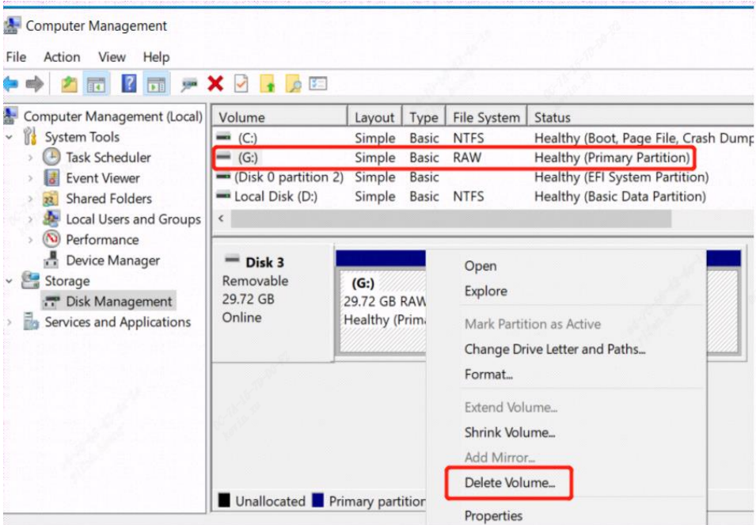
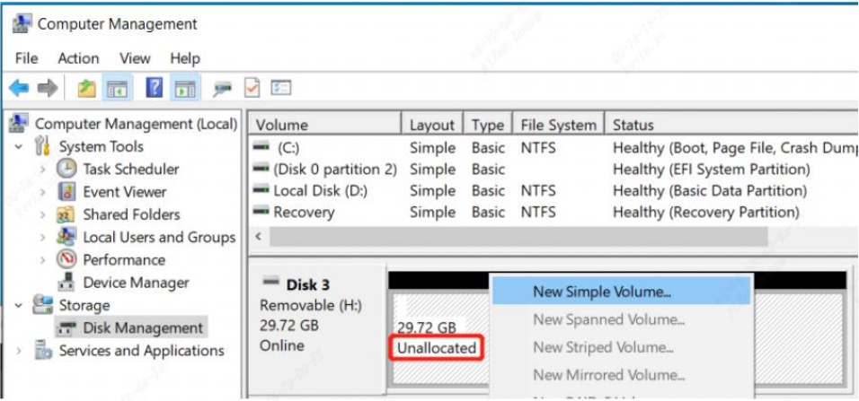
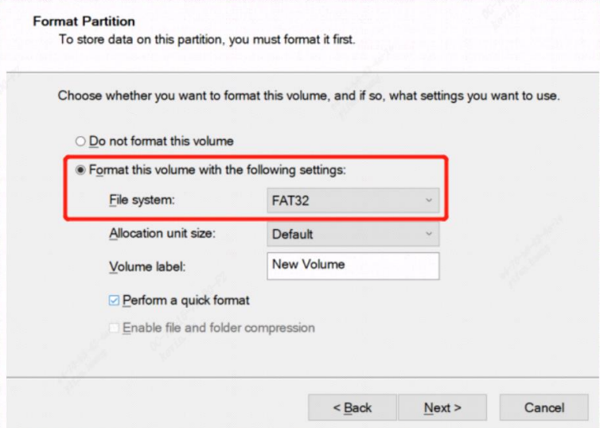
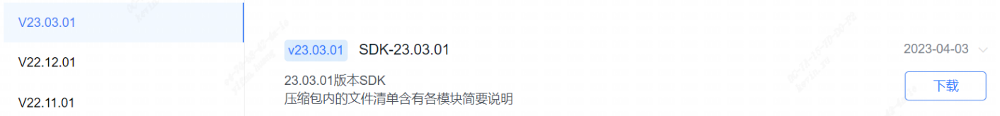
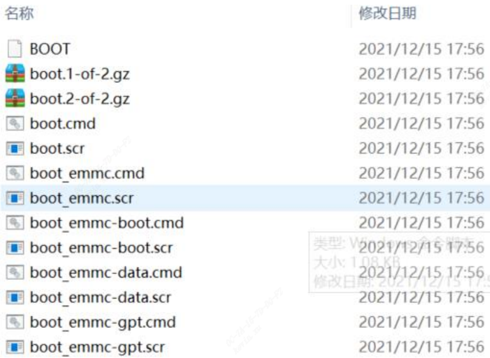
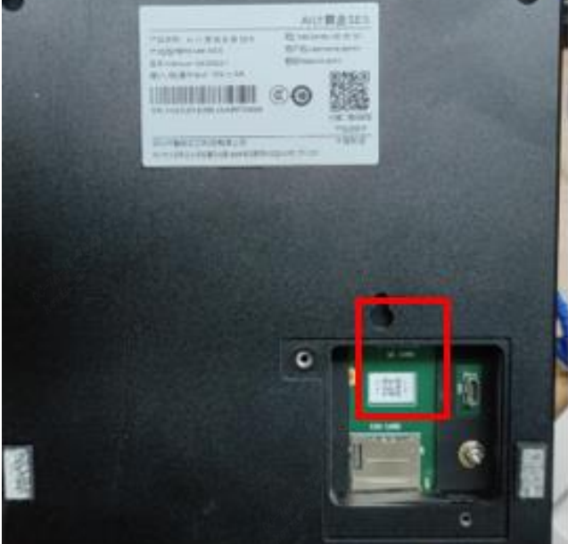
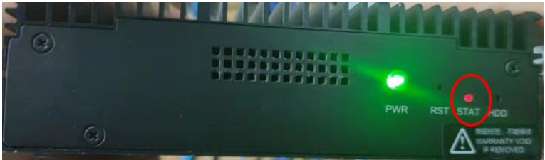
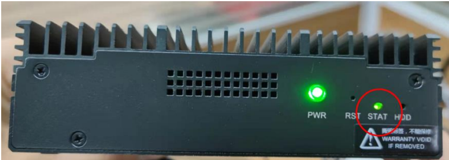

#### 刷机操作
#### SD卡固件升级  
一. 格式化 SD 卡  
  1. 准备一张至少 16GB 的 micro SD 卡和读卡器  
  2. 请运行 compmgmt.msc，打开计算机管理，选择磁盘管理，在右侧的磁盘列表中找到 SD（分区类型显示为 RAW），然后右键菜单选择删除卷（目前 boot ROM 的限制，SM5 仅支持使用 MBR 分区表，不支持 GPT，如果是 GPT 分区的，您把现有分区删光，重新建立分区，默认就会使用 MBR分区表）:  
  3. 删除卷后，SD 卡会变为未分配状态：  
  4. 此时再右键菜单选择新建简单卷，按照向导提示进行，注意文件系统类型选择FAT32，其余均保持默认设置即可：   
  5. 确保micro SD 是FAT32 文件系统格式和MBR分区后，便可下面的升级操作    
     
二. 升级操作  
  1. 官网下载压缩包，下载网址：  
    https://developer.sophgo.com/site/index/material/35/all.html  
    下载对应 SDK 包，包里的sophon-imgxxx 包里有 sdcard.tgz 包。  
    下载对应版本，示例如下：
      
  2. 解压下载后的压缩包，并进入 sdcard 目录下（注意一定要点击进入该目录下，上级目录md5 文件是不需要拷贝的，也不能直接复制整个文件夹，必须进入该目录下），然后将 sdcard 这个文件夹下的内容全选并复制，然后拷贝到 miniSD 卡的根目录下：  
      
  3. 确保 SE5 处于断电状态，拆卸维护窗盖板，插入 MicroSD 卡  
      
  4. 将设备上电，此时 STAT 灯呈现 为红色（常亮）状态。  
    
  5. 等待几分钟左右，一直到盒子灯变为绿色：  
    
  6. 拔掉设备电源线（下电），拔掉 SD 卡  
  7. 升级完成，重新插上电源线