#### 网络连接
  1. 如果是 windows 系统， 请下载 Xshell 工具，下载链接：https://xshell.en.softonic.com。  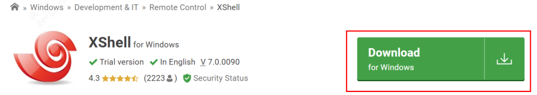
  2. 准备两根网线，分别插入 SE5 盒子 LAN 口和 WAN 口，其中 lan 口网线即图中黑色网线需要接入电脑， wan 口网线接入局域网内的交换机或者路由器。  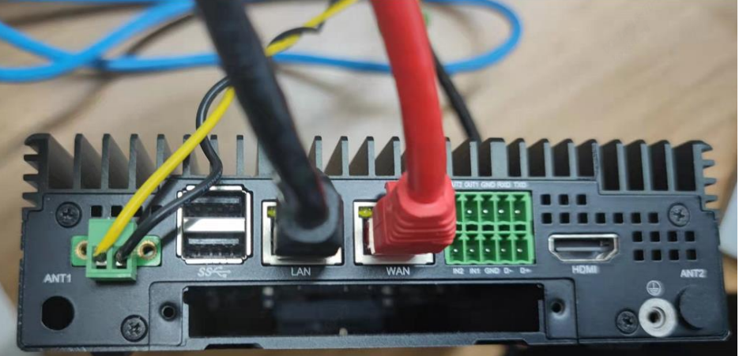 
  3. 配置电脑 ip 为 192.168.150.2，配置电脑 ip 如下：  
    a. 打开网络配置  
    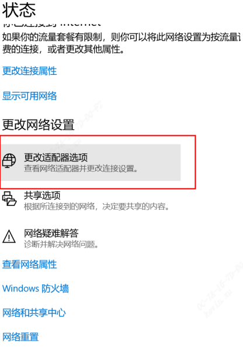  
    b. 点击对应以太网进行配置，右键弹出，并点击属性  
    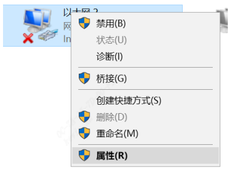  
    c. 双击点击 IPV4 打开:  
    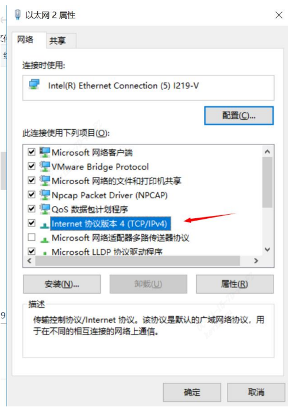  
    d. 配置地址，并点击确定：  
    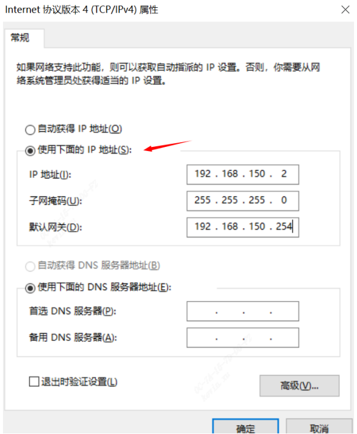  
    e. 再点一次确定：  
    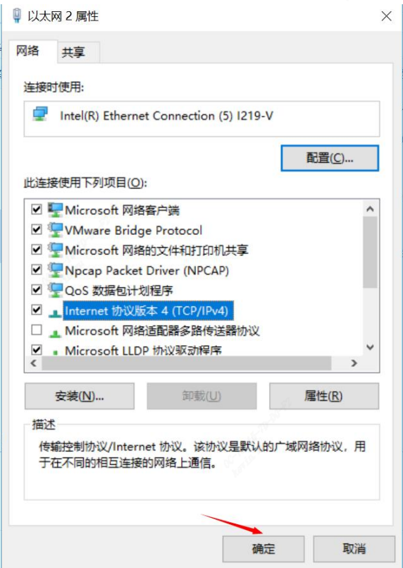  
  4. 进入电脑的桌面，在电脑桌面的左下角找到开始图标，单击你的鼠标右键，弹出快捷的设置菜单，在快捷设置菜单里面找到运行选项，点击这个选项，弹出运行对话框，并输入 cmd:   
    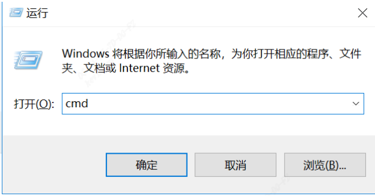
  5. 输入 ping 192.168.150.1, ping 通则表示 ip 配置成功，前提之前的步骤中电脑已经插上网线直连盒子 LAN 口:  
    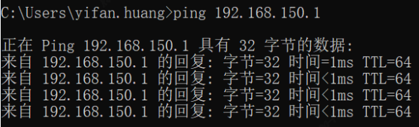
  6. 打开 Xshell 软件，点击新建，输入 ip 192.168.150.1： 
    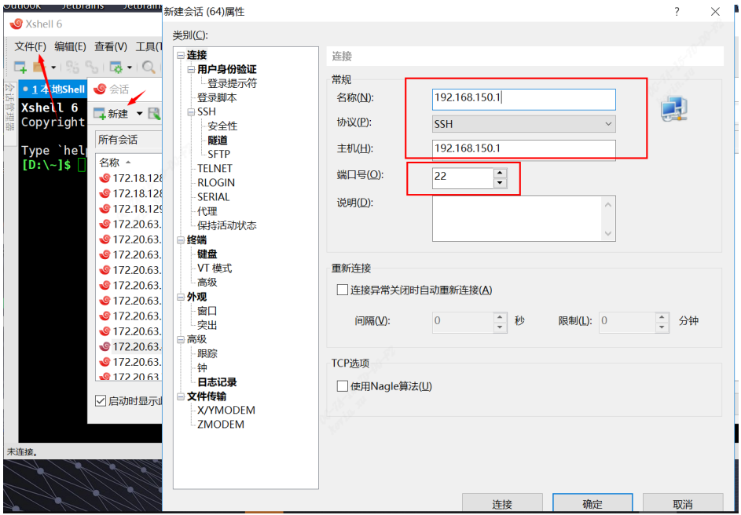  
  7. 输入用户名/密码， linaro/linaro, 并点击确定：  
    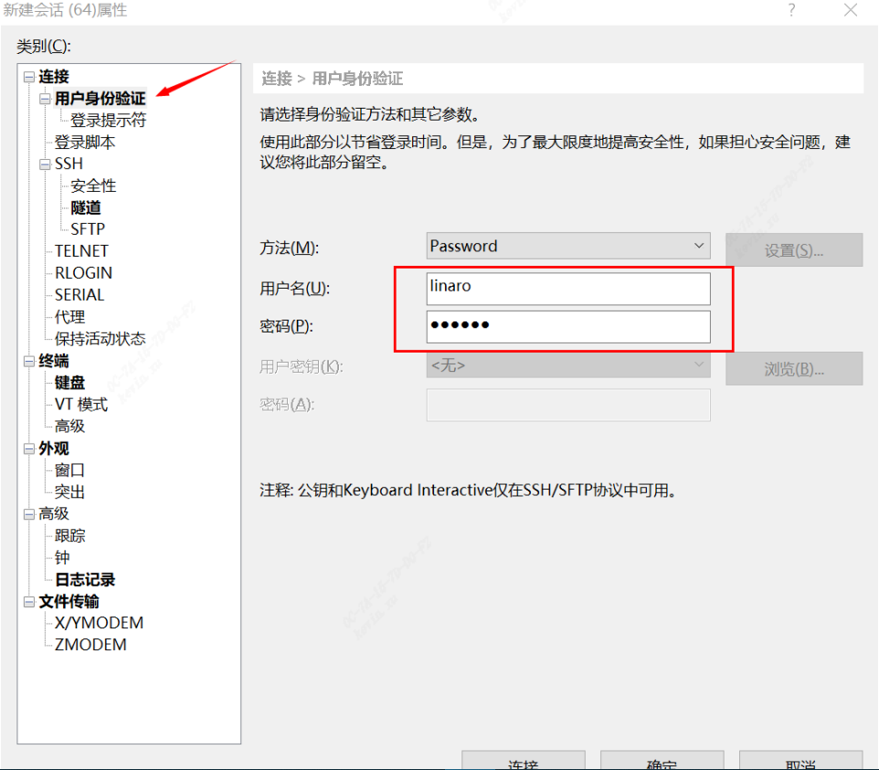  
  8. 双击确定连接：  
    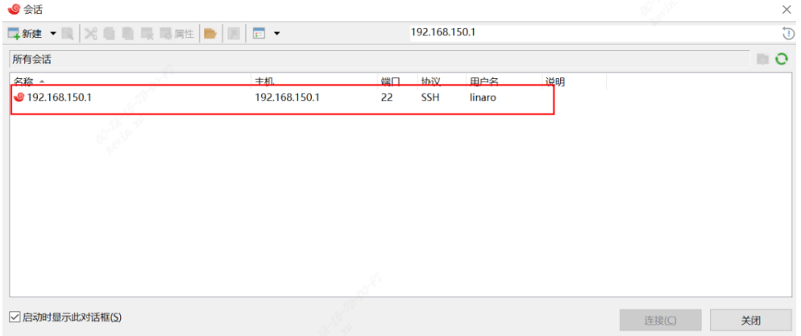
  9. 点击确定并保存：
    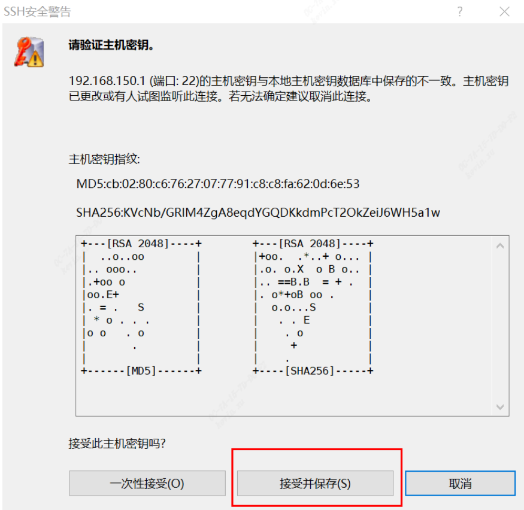
  10. 输入 sudo –i 并回车确认:
    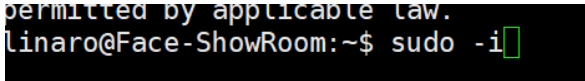
  11. 输入 ifconfig 并回车确认：
    
  12. 如下图中 eth0 地址为 wan 口地址， eth1 地址为 LAN 口地址
    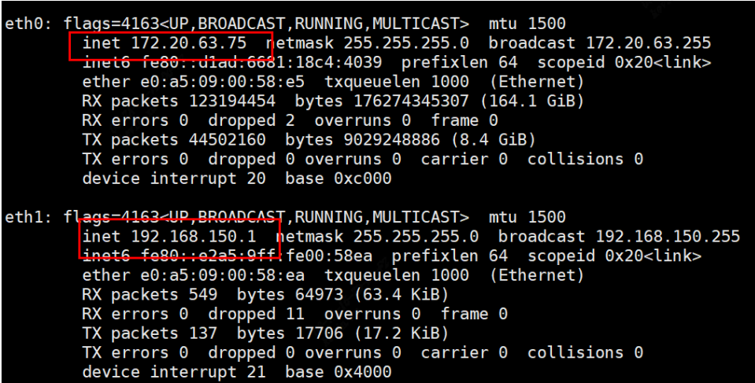
  13. 电脑查到 SE5 盒子 ip 后，即可拔掉连接 SE5 盒子的网线， 转而接入交换机或者路由器里，即接入局域网中，并恢复配置，之后就可以用 wan 口地址访问盒子了:
    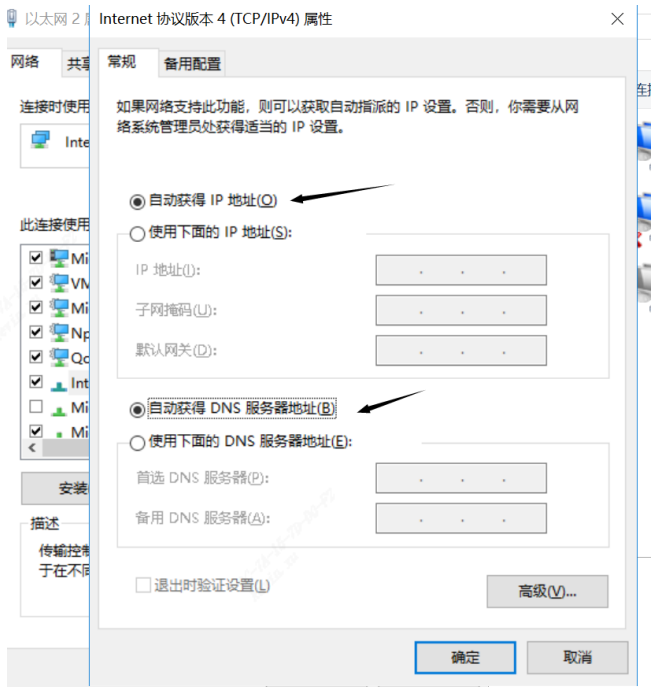 
