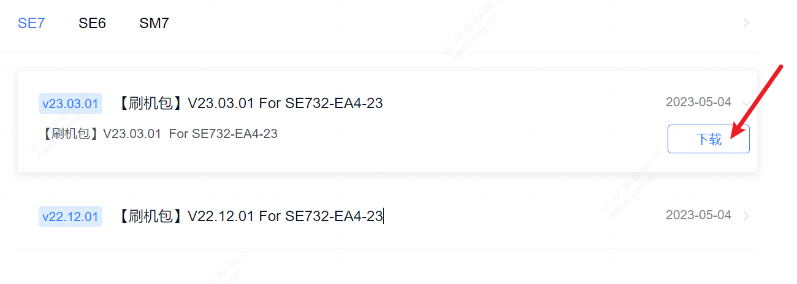
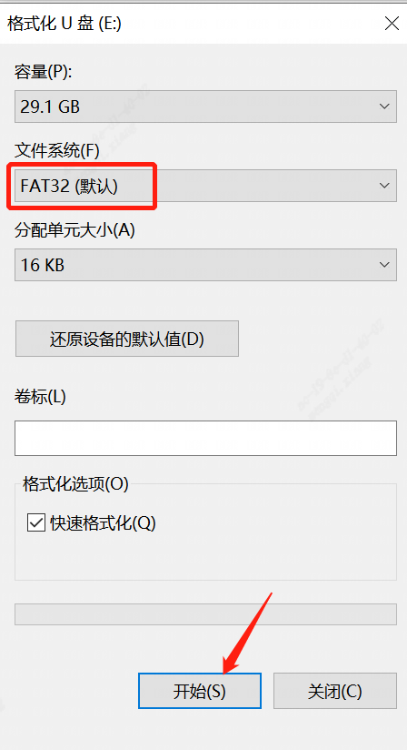
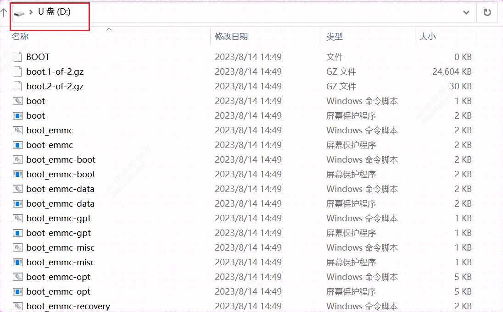

本文介绍SE7版本升级是通过SD卡烧录方式进行，请提前准备：

1. 至少16G 存储的Micro SD

2. 一个配套的读卡器
### 一、获取img最新版本
1. 官方下载地址：https://developer.sophgo.com/site/index/material/36/all.html
 
### 二、制作SD卡
1. 准备一张32G或者16G的sd卡。格式化成vfat或者是ext4.保证必须要一个分区例如：/dev/sda1，而非/dev/sda。
Windows系统下选中U盘点击右键，再点击格式化，选择“FAT32”文件系统

    

2. 解压下载后的压缩包，并进入 sdcard 目录下（注意一定要点击进入该目录下，上级目录有 md5 文件是不需要拷贝的，也不能直接复制整个文件夹，必须进入该目录下），然后将 sdcard 这个文件夹下的内容全选并复制，然后拷贝到 miniSD 卡的根目录下：
 

### 三、升级SE7
1. 将SD卡接口朝下插入到SE7的TF CARD内，再将机器上电；观察STAT指示灯，绿色与黄色交替闪烁，表示正在刷机
 

2. 等待几分钟，直至黄色灯熄灭绿色灯闪烁
 

3. 下电，拔掉SD卡，上电后，绿灯常亮则升级完成

