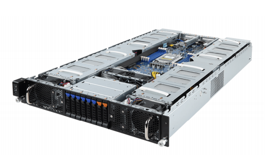

## SG6详情
## SG6-6-A22
算丰AI服务器SG6搭载算丰云边 AI 芯片 BM1684 ，是面向 AI 推理的高密度服务器。高效适配市场上所有 AI 算法，实现视频结构化、人脸识别、行为分析、状态监测等应用，为智慧城市、智慧交通、智
慧能源、智慧金融、智慧电信、智慧工业等领域进行 AI 赋能。

### 超高算力密度
* 316 TOPS INT8算力 ，超高算力利用率
* 39 TFLOPS FP32 算力
* 684路 25fps 高清视频硬件解码
### 软件开发包成熟易用
* 适配各种主流深度学习框架
* SDK和工具链成熟易用，算法迁移快捷
### 产品规格
| 产品型号 | SG6-06-A22 |
| :---- | :---- |
| 产品形态 | 2U机架式 AI 服务器 |
| AI算力 | INT8 316.8 TOPS FP32 39.6 TFLOPS |
| 视频解码能力 | H.264 & H.265: 1080P @17280fps |
| 视频解码分辨率 | 8192 * 8192 / 8K / 4K / 1080P / 720P / D1 / CIF |
| 视频编码能力 | H.264 & H.265: 1080P @900fps
| 视频编码分辨率 | 4K / 1080P / 720P / D1 / CIF |
| 视频转码能力 | 最大324 路 (1080P to CIF)
| 图片解码能力 | JPEG: 14400张/秒 @1080P |
| 显存规格 | 216GB LPDDR4x 1152GB/s |
| 协处理器 | ARM A53 144核 @2.3GHz |
| 尺寸及重量 | 2U(87*436*815mm) 30.2kg |
| 处理器 | 2颗 Intel Xeon 第二代可拓展处理器 |
| 内存 | 24 * DDR4 DIMM 3200MHz，最高 3TB |
| 存储 | 12块 2.5/3.5“ SATA/ SAS 硬盘 |
| 接口 | 前：2 * USB3.0,1 * VGA 后：2 * USB3.0,1 * VGA,1 * RJ45 串口 ,1 * RJ45 系统管理接口 ,2 * GE 口 内：1 * USB2.0,2 * 7pin SATA; |
| 电源 | 2个 1300W 铂金电源 支持 1+1 冗余模式 |
| 工作温度 | 5°C ~ 35 °C |
| 操作系统 | Ubuntu / CentOS / Debian |
| 深度学习框架 | TensorFlow / PyTorch /Paddle / Caffe / ONNX / MXNet / Tengine /DarkNet|

## SG6-6-A32

## SG6-10-B22
### 产品规格
| 产品型号 | SG6-10-B22 |
| :---- | :---- |
| 产品形态 | 2U机架式AI服务器 |
| AI算力 | INT8 528 TOPS FP32 66 TFLOPS |
| 视频解码能力 | H.264 & H.265: 1080P @28800fps |
| 视频解码分辨率 | 8192 * 8192 / 8K / 4K / 1080P / 720P / D1 / CIF |
| 视频编码能力 | H.264 & H.265: 1080P @1500fps
| 视频编码分辨率 | 4K / 1080P / 720P / D1 / CIF |
| 视频转码能力 | 最大540 路 (1080P to CIF)
| 图片解码能力 | JPEG: 24400张/秒 @1080P |
| 显存规格 | 216GB LPDDR4x 1152GB/s |
| 协处理器 | ARM A53 240核 @2.3GHz |
| 尺寸及重量 | 2U(87\*436\*815mm) 33.2kg |
| 处理器 | 1颗 AMD EPYC 7002系列处理器 |
| 内存 | 8 * DDR4 DIMM 3200MHz，最高1TB |
| 存储 | 6块2.5" SATA/SAS硬盘 / 2块2.5" U.2 NVMe/SATA SSD |
| 接口 |2个SFP + 10G LAN接口，2 x USB3.0 / 1 x VGA / 1 x MGMT |
| 电源 | 2个2200W 80 PLUS铂金电源，支持1+1冗余模式|
| 工作温度 | 10°C ~ 35°C |
| 操作系统 | Ubuntu / CentOS / Debian |
| 深度学习框架 | TensorFlow / PyTorch /Paddle / Caffe / ONNX / MXNet / Tengine /DarkNet|
***