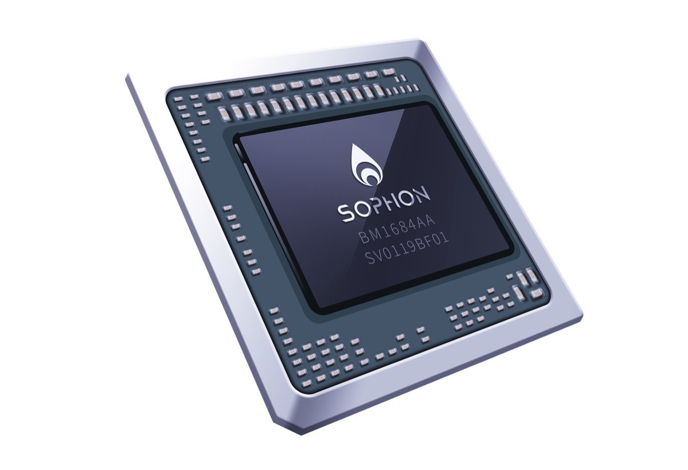

# 主要芯片
## BM1684详情

### 产品规格
| 芯片型号 | BM1684 |
| :---- | :---- |
|AI算力 | INT8 17.6TOPS FP32 2.2TFLOPS |
|主控CPU | ARM A53 8核 42320 DMIPS 2.3GHz|
|视频编解码能力 | H.264 & H.265:1080P@960fps视频解码能力 H.264 & H.265:1080P@50fps视频编码能力 |
| 图片解码能力 | JPEG 480 张/秒@1080P |
| 内存 | 最大16GB |
| 存储 | EMMC:32GB FLASH:16MB |
| 接口 | 1个 PCIE EP X16 Gen3 1个 PCIE EPX8 Gen3 /1个PCIE RC X8 Gen3 10/100/1000 RGMII X2 I2C/UART/PWM/SPI/GPIO |
| 工作温度 | -40℃ ~ +105℃ |
| 典型功耗 | 16W |
| 深度学习框架 | TensorFlow /Pytorch / Paddle / Caffe / MxNet / Tengine / DarkNet |

## BM1684X详情

### 产品规格

| 芯片型号 | BM1684X |
| :---- | :---- |
| 产品型号 | BM1684X |
| 处理器 | 8xARM A53 2.3GHz |
| 内存 | LPDDR4/LPDDR4x 4266Mbps 最大支持 16GB|
| AI算力 | 32 TOPS INT8 16 TFLOPS FP16/BF16 2 TFLOPS FP32|
| 视频解码 | H.264&H.265:32x1080P@25fps 8x4K@25fps H.265:1x8K@25fps|
| 视频编码 | H.264&H.265: 12x1080P@25fps,3x 4K@25fps ，最大支持 8K|
| 图片编解码| JPEG 1080P@600fps ，最大支持 32768 32768 |
| 视频后处理 | 支持图像 CSC 、 Resize 、 Crop 、 Padding 、 Border 、 Font 、 Contrast Brightness Adjustment|
| 高速接口 | PCIe Gen3 X16 EP \| X8 RC + X8 EP 2x10/100/1000Mbps RGMII 1x SD/SDIO controller 1x eMMC 4.5/5.1|
| 低速接口 | 1xSPI Flash 接口 3xUART接口 3xI2C接口 2xPWM接口 2x风扇 转速检测 接口|
| 安全性 | 支持安全启动 支持Trustzone 支持真随机数产生 支持安全密钥存储机制 支持AES/DES/SM4/SHA/RSA/ECC 等硬件加速 |
| 典型功耗 | 17W |
| 工作温度 | -40 ℃℃~ +105 |
| 工具链 | PyTorch / ONNX / Paddle / TensorFlow / Caffe / MXNet / Darknet |
